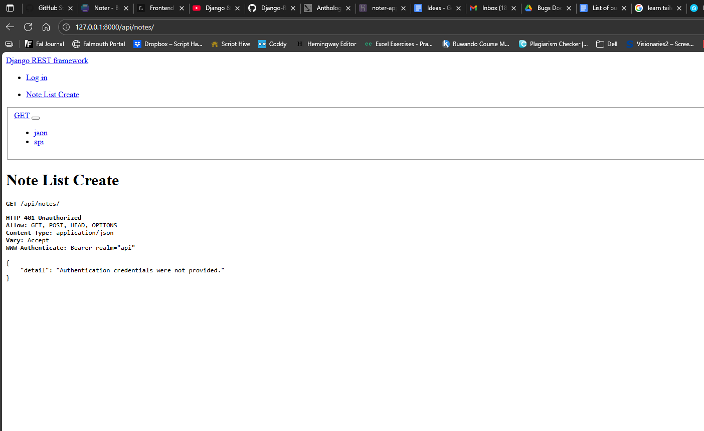

# Noter
 
See the live version of Noter, here: [Noter Deployed Site](https://tstyer.github.io)

---

## Introduction

Welcome to the Noter project.

This is a simple, responsive website built using *HTML, Tailwind CSS, JavaScript, React.JS, Jest, Python,* and *Django*. It serves as a simple note-taking app, deisgned to be easily accessed and simple to navigate. 

---

## Table of Contents

- [User Experience (UX)](#user-experience-ux)
  - [Strategy Plane](#strategy-plane)
  - [Scope Plane](#scope-plane)
  - [Structure Plane](#structure-plane)
  - [Skeleton Plane](#skeleton-plane)
  - [Surface Plane](#surface-plane)
- [Wireframes](#wireframes)
- [Features](#features)
- [Technologies Used](#technologies-used)
- [Deployment](#deployment)
- [Testing](#testing)
  - [User Stories Testing](#user-stories-testing)
  - [Manual Testing](#manual-testing)
  - [Validators and Tools](#validators-and-tools)
  - [Bugs](#bugs)
- [Credits](#credits)
- [Acknowledgements](#acknowledgements)

---

## User Experience (UX)

To ensure great user experience, it's imperative to know who my target audiences are. Afterwhich, I can craft a strategy to appeal to them, stating the benefits and how Noter can eliminate certain problems they want to avoid (cost of similar apps, simplicity, etc.). These descriptions will be displayed on text that contrasts well with the background, neatly fitting into sections that are located on the homepage. 

### Strategy Plane

As the developer for the App, my goal is to provide an app that satisfies the users needs. Particularly, this will be an app that is free, easy to use, and holds no bounds to the amount of notes a user can create. 

I will also look to create a visually stunning app, produced with Tailwind and Javascript for frontend design. 

From a business perspective, the goal for the 'Noter' website is to show prospective users that it is the best (free) option for students and professionals. It offers this through easy navigation, understandable text, and an intuitive layout. 

The site includes key informational sections such as an introduction to the service, the 'new note' section, the ability to amend, update and delete notes, the user who created the note, all presented in a clear and visually appealing manner.

### Demographics

The main users of the site will be students (school or university) and employees. The scope for their locatin is global, but the first publication of the app will only be in English.

There is no particular age, but the majority will likely be late-teen's to late-50's, men and women.  

#### Target User Goals

The goal for the target user will be to learn what Noter is, what makes it unique, and why they should use the app for taking notes. 
They will be searching for apps that can offer a basic, simple design, that allows you to write and store notes instantly. 
They'll be looking for reliability in the app. 

#### First-Time Visitors

1. As a first-time visitor, I want to see why I should choose Noter over another options.   
  
2. As a first time visitor, I want to easily understand how to write and store notes.
   
3. As a first-time visitor, I want to easily navigate to any contact information or page.
 
4. As a first-time visitor, I want to see social proof.    
  

#### As a Returning Visitor

1. As a returning visitor, I want to easily navigate to their contact page.
   
2. As a returning visitor, I want to easily find their social media links to see their social proof with current clients.
   
3. As a returning visitor, I want to see my notes saved and in order. 
   
4. As a returning visitor, I'd like to easily access and navigate the site via a mobile or tablet.
   

### Scope Plane

During the planning phase, research was conducted into similar apps, such as Microsoft OneNote and Notion to identify best practices in layout, typography, and color schemes. The project was developed with Git and GitHub used for version control. The creation process involved iteratively building and refining the site layout, ensuring responsiveness across devices, and maintaining visual consistency throughout.

- Features included (MVP + additional ideas)
- Features not included (and why)

### Structure Plane
- Information architecture
- Navigation model

### Skeleton Plane
- Wireframes for mobile, tablet, desktop
- Priority/content layout decisions

### Surface Plane
- Final design decisions (color palette, fonts, visual elements)

---

## Wireframes

Provide links or embedded images of your wireframes:
- Home page (Mobile / Tablet / Desktop)
- Other pages..

--- 

## Features

List and explain key features implemented in the project.

---

## Technologies Used

- HTML5
- CSS3
- JavaScript
- [Any frameworks/libraries]
- [Design/UX tools used like Balsamiq]

---

## Deployment

Explain how your project is deployed and how someone can clone and run it locally. Expand on this:
1. Clone this repository
2. Open in VS Code
3. Install dependencies
4. Run application

Link to live site: [Deployed Site](#)

---

## Testing

### User Stories Testing

List your user stories and describe how each was met in the final project.

### Manual Testing

- Navigation
- Responsiveness
- Browser compatibility
- Forms and interactivity

### Manual Testing

#### Testing of URL Path: /api/note

The above shows the basic html layout provided by Django and says we are unauthorized, which is correct. 

- Example 1
- Example 2
- etc. ...

### Validators and Tools

- HTML Validator
- CSS Validator
- Lighthouse Report (Accessibility, SEO, etc.)

### Bugs

- Describe bugs encountered
- How you fixed them

---

## Credits

- [Links to any external code, images, or media]
- Clearly cite all third-party assets

Create credit for django documentation used for the functions in the views: https://docs.djangoproject.com/en/5.2/topics/http/views/

---

## Acknowledgements

Mention any tutorials, mentors, or support resources used.

---

